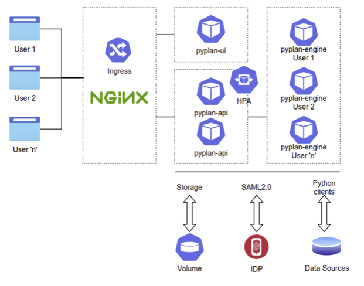

Pyplan and Kubernetes 
---------------------

Pyplan uses Kubernetes to grant a both scalable and high-availability service.  The architecture based on containers allows Pyplan to get optimal use of resources, enabling it to define how much CPU and memory grant to certain user groups.
A key feature of this platform is the ability to horizontally scale up as workloads increase and scale back down as they reduce, which is used in Pyplan to ensure consistent performance for our customers regardless of the number of users on the platform. Automated monitoring and adjustment of resources allows all components of the platform to have the right resources at the right time.   

A reference diagram for our Kubernetes deployment is shown below:  

Some of the key technologies used in Pyplan are:

**Kubernetes**: Kubernetes provides automated container deployment, scaling, and management. For more information see https://kubernetes.io/  

**NGINX Ingress Controller**: NGINX Ingress Controller provides the web interface and internal load balancing for Pyplan tenants. NGINX is an HTTP and reverse proxy server, a load balancing server and a generic TCP/UDP proxy server. See https://www.nginx.com/products/nginx/kubernetes-ingress-controller/  

**Redis**: Redis is an in-memory data structure store used as a database, cache and message broker. https://redis.io/

**PostgreSQL** PostgreSQL is a powerful object-relational database system with over 30 years of active development that has earned a strong reputation for reliability, feature robustness and performance. It is used as the repository within Pyplan https://www.postgresql.org/
