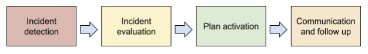
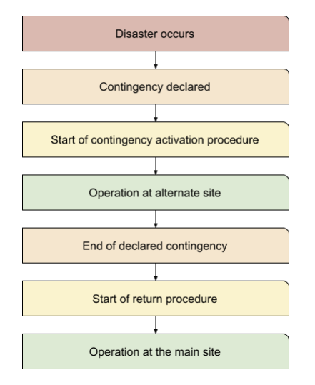

======================
Disaster Recovery Plan 
======================

This section contains the plan and description regarding the operational activities for Pyplan application disaster recovery.

Introduction
------------

The section describes the operational procedures for Pyplan application recovery when a disaster event occurs that affects an entire IaaS Cloud Availability Zone where Pyplan
production environment resides.

Target time
-----------

The temporal objectives to recover the entire application are:

- RPO = 24 hours.
- RTO = 36 hours.

Conditions for reactivating services
------------------------------------

To reactivate the Pyplan application service, the following conditions must be met:

- there must be an uninterrupted availability zone.
- all services used by Pyplan must be working correctly in the new availability zone

Event classification
--------------------

=============== ================================= =========================================== =====================================
Event Type       Description                       Examples                                    Response
=============== ================================= =========================================== =====================================
  DISASTER        Event that disables the Data     Earthquakes, general fire, power failure,   Activation of disaster recovery plan
                  Center to provide its services   natural catastrophes, others
  INTERRUPTION    Event that needs to be           Systems or service failure                  Activation of disaster recovery plan
                  evaluated to be handled as                                                   or contingency application
                  a disaster or as a contingency.
                  Depends on the impact 
                  determined in incident 
                  management.
  CONTINGENCY     Event that impacts a resource    Module failure or temporary failure         Contingency plan
                  necessary for the provision of
                  services
=============== ================================= =========================================== =====================================
   
Activation phases
-----------------

Notification procedure
----------------------

Notification of the unavailability of information systems or IT services can come from
different sources, depending on the nature of the event, the time at which it occurs and
the source that causes it.

Activation process
------------------

The following is a description of the process by which the management plan is activated,
after notification of the disaster:

Operating tasks
---------------

Next table shows the operational tasks that will be carried out in the event of applying the
disaster recovery plan    

======================================================== =====================
Task                                                      Target time (hours)
======================================================== =====================
Deployment of architecture in a new availability zone     20
Data restoration using the latest available backup        12
Manual operation tests                                     2
Run the automatic stress tests                             1
URL release for production use                             1
======================================================== =====================

Test of the disaster recovery plan
----------------------------------

Pyplan performs annual disaster recovery plan tests 