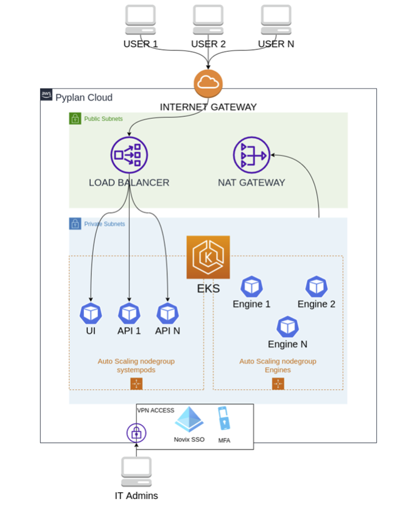

Pyplan Cloud - AWS 
==================

In order to ensure a strong, secure foundation, Pyplan Cloud shares security responsibilities with an industry leading cloud infrastructure vendor and valued partner. These cloud computing services are used by Pyplan for internal purposes as well as Pyplan clients for their own cloud deployments. 

Pyplan Cloud relies on cloud infrastructure for secure physical access, redundant (fault tolerant) infrastructure and scalability. 

Our cloud partner's network design and monitoring mitigate common types of network security issues such as Distributed Denial of Service (DDoS), Man in the Middle (MITM), IP Spoofing, Port Scanning or packet sniffing. 

The geographical location of Pyplan Cloud's storage and infrastructure is in the United States. In case this location is not standardized by the customer (in relation to General Data Protection Regulation - GDPR), the customer may opt for an on-premise installation in a location that is in accordance with its internal rules. 

A reference diagram for our Cloud deployment is shown below: 

The access to infrastructure management is performed exclusively by qualified staff, implementing all the security measures offered by the supplier (i.e., Multi-factor Authentication (MFP), Internet Protocol (IP) filtering, etc.).      

Pyplan and Kubernetes 
---------------------

Pyplan uses Kubernetes to grant a both scalable and high-availability service.  The architecture based on containers allows Pyplan to get optimal use of resources, enabling it to define how much CPU and memory grant to certain user groups.
A key feature of this platform is the ability to horizontally scale up as workloads increase and scale back down as they reduce, which is used in Pyplan to ensure consistent performance for our customers regardless of the number of users on the platform. Automated monitoring and adjustment of resources allows all components of the platform to have the right resources at the right time.   

A reference diagram for our Kubernetes deployment is shown below:  

.. figure:: images/pyplan-kubernetes.png

Some of the key technologies used in Pyplan are:

**Kubernetes**: Kubernetes provides automated container deployment, scaling, and management. For more information see https://kubernetes.io/  

**NGINX Ingress Controller**: NGINX Ingress Controller provides the web interface and internal load balancing for Pyplan tenants. NGINX is an HTTP and reverse proxy server, a load balancing server and a generic TCP/UDP proxy server. See https://www.nginx.com/products/nginx/kubernetes-ingress-controller/  

**Redis**: Redis is an in-memory data structure store used as a database, cache and message broker. https://redis.io/

**PostgreSQL** PostgreSQL is a powerful object-relational database system with over 30 years of active development that has earned a strong reputation for reliability, feature robustness and performance. It is used as the repository within Pyplan https://www.postgresql.org/

Backup Policies
---------------

Pyplan Cloud performs daily backups. Such backup information is stored encrypted for 1 month after which it is moved to a cold storage for 5 additional months. After such period, the backup information is deleted. 

Service Level Agreement (SLA)
-----------------------------

Pyplan Cloud will use reasonable efforts to make the application available with a monthly uptime percentage of at least **97.5%** 

SLA Exclusions 
--------------

The Service Commitment does not apply to any unavailability or suspension of Pyplan Cloud: (i) caused by factors outside of our reasonable control, including any force majeure event or Internet access or related problems beyond the demarcation point of Pyplan Cloud; (ii) that result from any voluntary actions or inactions from you or any third party; (iii) that result from your equipment, software or other technology and/or third-party equipment, software or other technology (other than third party equipment within our direct control) 

Status Page
-----------

Service status of Pyplan Cloud can be found at https://status.pyplan.com 

Predictable performance at scale  
--------------------------------

To ensure the best possible end user experience, Pyplan is exhaustively stress tested in order to be performant and scale accordingly. Several different configurations are tested to make sure that the tenants can cope with the expected use cases and loads. Some of the parameters tested include:  

- User ramp-up (that is, the number of users accessing the tenant per time unit) 
- User type 
- Number of concurrent users 
- Number and size of apps 
- Number, frequency and size of concurrent reloads 

Our web Architecture  
--------------------
 
Pyplan is accessible from any device via a web browser.  

Security is the key consideration in our architecture. Authentication is through the tenant's identity provider mechanism (using SAML 2.0) or through Pyplan own system. Session duration can be accomplished by a companywide configuration.  

As with a regular browser connection, both HTTP and WebSocket traffic to Pyplan is encrypted over Transport Level Security (TLS). For that reason, the Transmission Control Protocol (TCP) port used by Pyplan is the 443. 

How does Pyplan work? 
---------------------

Pyplan runs over a Kubernetes cluster. The containers listed below are the main structure of the application, where kubernetes will ensure its deployment into pods or another kubernetes resource and verify their status. 

- PYPLAN-UI 
- PYPLAN-API 
- PYPLAN-CELERY 
- PYPLAN-DB 
- PYPLAN-REDIS 

In Kubernetes, a Pod represents a set of running containers on your cluster. 
Every time a user opens a model, Pyplan needs to interact with the Kubernetes Application Progamming Interface (API) in order to instruct Kubernetes to generate a new pod - PYPLAN-ENGINE - that will be its workspace. Furthermore, when a user logs out or a timeout occurs, Pyplan destroys the pod belonging to that user, which will result in a release of resources. 
In other words, Pyplan needs to communicate with the Kubernetes cluster via its API to describe/create/delete pods that are assigned to its users. 

.. figure:: images/pyplan-kubernetes-flow.png

Scaling
-------

Pyplan uses Kubernetes to provide a scalable as well as a high-availability service. It uses HPA (Horizontal Pod Autoscaler) to ensure that all API requests are optimally answered. On installations in suppliers such as AWs, Azure, GPC, Pyplan uses the node and nodepools scalation to allocate each user’s counting. 

Monitoring tools 
----------------

Supported by monitoring tools available for Kubernetes, Pyplan includes a default dashboard tool to monitor the Kubernetes cluster, but also other tools such as Grafana, Prometheus, Jaeger, etc. can be used. 

These tools will only be available for qualified staff.     