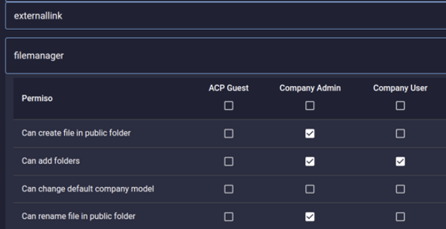

User Access Control
===================

Pyplan allows authentication through an Identity Provider using SAML 2.0. protocol. This ensures that the application adheres to all the authentication policies existing in the company. In case of not using authentication via Identity Provider (IdP), Pyplan allows the use of its own authentication system. Some of its characteristics are: 

- Passwords have the following restrictions: 

  - at least 10 characters  

  - at least one upper case character 

  - at least one lower case character  

  - at least one special character 

  - no expiration (on roadmap by mid-2022) 

  - reset after 3 failed login tries 

  - no password recovery (in case of loss, a new password must be generated) 

- Multifactor authentication is not implemented (on roadmap by 2023)

- Each user has a unique, non-reusable identifier  

 
Pyplan uses the Role concept to restrict the access of users to certain application functions. Departments are used for information restriction. 
Pyplan uses the principle of least privilege.

Concepts
--------

**Company**: it identifies the company to which the user belongs. It is the highest-level entity and it groups the rest of the entities. 

**Roles**: These are a set of permissions that deny or enable different functionalities of the application. Pyplan has an administrator that allows to define which Roles can have access to which application functions. 

**Departaments**: it allows to group users to limit the information access in different application sections. Users belonging to a department can:  

- have access to certain files in the file manager 
- have access to certain model nodes 
- see certain form records     

**Users**: it unequivocally identifies each application user. In case of using the own Pyplan user authentication system, the minimum information of each user shall be its login, full name, e-mail address and status (active/inactive).

User activity monitoring
------------------------

Pyplan provides a tool that allows system administrators to monitor each action performed by every user. 
This information is saved and stored for a 6 month period by default and this information is not modifiable. 
The fields stored are: 